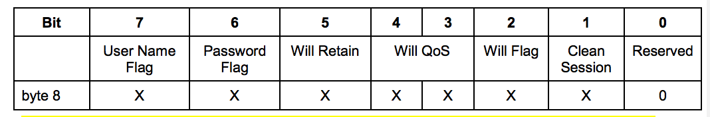
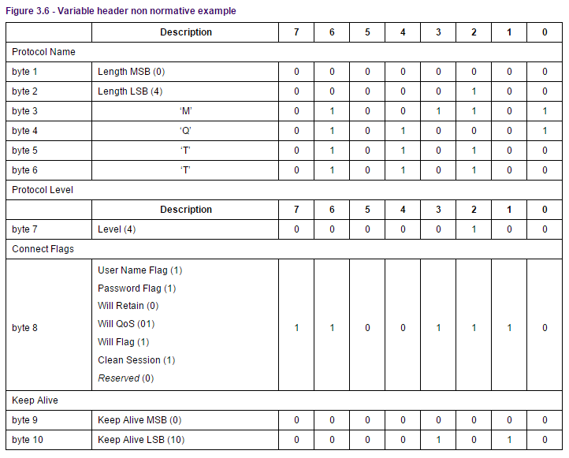

## 3.1 CONNECT – 连接服务端

客户端到服务端的网络连接建立后，客户端发送给服务端的第一个报文**必须**是CONNECT报文 \[MQTT-3.1.0-1\]。

在一个网络连接上，客户端只能发送一次CONNECT报文。服务端**必须**将客户端发送的第二个CONNECT报文当作协议违规处理并断开客户端的连接 \[MQTT-3.1.0-2\]。有关错误处理的信息请查看4.8节。

有效载荷包含一个或多个编码的字段。包括客户端的唯一标识符，Will主题，Will消息，用户名和密码。除了客户端标识之外，其它的字段都是可选的，基于标志位来决定可变报头中是否需要包含这些字段。

### 3.1.1 固定报头 Fixed header

##### 图例 3.1 –CONNECT报文的固定报头

<table style="text-align:center">
   <tr>
     <td align="center"><strong>Bit</strong></td>
     <td align="center"><strong>7</strong></td>
     <td align="center"><strong>6</strong></td>
     <td align="center"><strong>5</strong></td>
     <td align="center"><strong>4</strong></td>
     <td align="center"><strong>3</strong></td>
     <td align="center"><strong>2</strong></td>
     <td align="center"><strong>1</strong></td>
     <td align="center"><strong>0</strong></td>
   </tr>
   <tr>
     <td>byte 1</td>
     <td colspan="4" align="center">MQTT报文类型 (1)</td>
     <td colspan="4" align="center">Reserved 保留位</td>
   </tr>
   <tr>
     <td></td>
      <td align="center">0</td>
      <td align="center">0</td>
      <td align="center">0</td>
      <td align="center">1</td>
      <td align="center">0</td>
      <td align="center">0</td>
      <td align="center">0</td>
      <td align="center">0</td>
   </tr>
   <tr>
     <td>byte 2...</td>
     <td colspan="8" align="center">剩余长度</td>
   </tr>
 </table>

**剩余长度字段**

剩余长度等于可变报头的长度（10字节）加上有效载荷的长度。编码方式见 2.2.3节的说明。

### 3.1.2 可变报头 Variable header

CONNECT报文的可变报头按下列次序包含四个字段：协议名（Protocol Name），协议级别（Protocol Level），连接标志（Connect Flags）和保持连接（Keep Alive）。

#### 协议名 Protocol Name

##### 图例 3.2 -协议名字节构成

|        | **说明**     | **7** | **6** | **5** | **4** | **3** | **2** | **1** | **0** |
|--------|--------------|-------|-------|-------|-------|-------|-------|-------|-------|
| 协议名 |
| byte 1 | 长度 MSB (0) | 0     | 0     | 0     | 0     | 0     | 0     | 0     | 0     |
| byte 2 | 长度 LSB (4) | 0     | 0     | 0     | 0     | 0     | 1     | 0     | 0     |
| byte 3 | ‘M’          | 0     | 1     | 0     | 0     | 1     | 1     | 0     | 1     |
| byte 4 | ‘Q’          | 0     | 1     | 0     | 1     | 0     | 0     | 0     | 1     |
| byte 5 | ‘T’          | 0     | 1     | 0     | 1     | 0     | 1     | 0     | 0     |
| byte 6 | ‘T’          | 0     | 1     | 0     | 1     | 0     | 1     | 0     | 0     |

协议名是表示协议名 *MQTT* 的UTF-8编码的字符串。MQTT规范的后续版本不会改变这个字符串的偏移和长度。

如果协议名不正确服务端**可以**断开客户端的连接，也**可以**按照某些其它规范继续处理CONNECT报文。对于后一种情况，按照本规范，服务端**不能**继续处理CONNECT报文 \[MQTT-3.1.2-1\]。

> **非规范评注**
>
> 数据包检测工具，例如防火墙，可以使用协议名来识别MQTT流量。

#### 协议级别 Protocol Level

##### 图例 3.3 - Protocol Level byte协议级别字节构成

|          | **说明** | **7** | **6** | **5** | **4** | **3** | **2** | **1** | **0** |
|----------|----------|-------|-------|-------|-------|-------|-------|-------|-------|
| 协议级别 |
| byte 7   | Level(4) | 0     | 0     | 0     | 0     | 0     | 1     | 0     | 0     |

客户端用8位的无符号值表示协议的修订版本。对于3.1.1版协议，协议级别字段的值是4(0x04)。如果发现不支持的协议级别，服务端**必须**给发送一个返回码为0x01（不支持的协议级别）的CONNACK报文响应CONNECT报文，然后断开客户端的连接 \[MQTT-3.1.2-2\]。

#### 连接标志 Connect Flags

连接标志字节包含一些用于指定MQTT连接行为的参数。它还指出有效载荷中的字段是否存在。

##### 图例 3.4 -连接标志位

服务端**必须**验证CONNECT控制报文的保留标志位（第0位）是否为0，如果不为0必须断开客户端连接 \[MQTT-3.1.2-3\]。

#### 清理会话 Clean Session

**位置：**连接标志字节的第1位

这个二进制位指定了会话状态的处理方式。

客户端和服务端可以保存会话状态，以支持跨网络连接的可靠消息传输。这个标志位用于控制会话状态的生存时间。

如果清理会话（CleanSession）标志被设置为0，服务端**必须**基于当前会话（使用客户端标识符识别）的状态恢复与客户端的通信。如果没有与这个客户端标识符关联的会话，服务端**必须**创建一个新的会话。在连接断开之后，当连接断开后，客户端和服务端**必须**保存会话信息 \[MQTT-3.1.2-4\]。当清理会话标志为0的会话连接断开之后，服务端**必须**将之后的QoS 1和QoS 2级别的消息保存为会话状态的一部分，如果这些消息匹配断开连接时客户端的任何订阅 \[[MQTT-3](https://tools.oasis-open.org/issues/browse/MQTT-3).1.2-5\]。服务端也**可以**保存满足相同条件的QoS 0级别的消息。

如果清理会话（CleanSession）标志被设置为1，客户端和服务端**必须**丢弃之前的任何会话并开始一个新的会话。会话仅持续和网络连接同样长的时间。与这个会话关联的状态数据**不能**被任何之后的会话重用 \[MQTT-3.1.2-6\]。

客户端的会话状态包括：

-   已经发送给服务端，但是还没有完成确认的QoS 1和QoS 2级别的消息
-   已从服务端接收，但是还没有完成确认的QoS 2级别的消息。

服务端的会话状态包括：

-   会话是否存在，即使会话状态的其它部分都是空。
-   客户端的订阅信息。
-   已经发送给客户端，但是还没有完成确认的QoS 1和QoS 2级别的消息。
-   即将传输给客户端的QoS 1和QoS 2级别的消息。
-   已从客户端接收，但是还没有完成确认的QoS 2级别的消息。
-   可选，准备发送给客户端的QoS 0级别的消息。 

保留消息不是服务端会话状态的一部分，会话终止时**不能**删除保留消息 \[MQTT-3.1.2.7\]。

有关状态存储的限制和细节见第 4.1节。

当清理会话标志被设置为1时，客户端和服务端的状态删除不需要是原子操作。

> **非规范评注**
>
> 为了确保在发生故障时状态的一致性，客户端应该使用会话状态标志1重复请求连接，直到连接成功。
>
> **非规范评注**
>
> 一般来说，客户端连接时总是将清理会话标志设置为0或1，并且不交替使用两种值。这个选择取决于具体的应用。清理会话标志设置为1的客户端不会收到旧的应用消息，而且在每次连接成功后都需要重新订阅任何相关的主题。清理会话标志设置为0的客户端会收到所有在它连接断开期间发布的QoS 1和QoS 2级别的消息。因此，要确保不丢失连接断开期间的消息，需要使用QoS 1或 QoS 2级别，同时将清理会话标志设置为0。
>
> **非规范评注**
>
> 清理会话标志0的客户端连接时，它请求服务端在连接断开后保留它的MQTT会话状态。如果打算在之后的某个时间点重连到这个服务端，客户端连接应该只使用清理会话标志0。当客户端决定之后不再使用这个会话时，应该将清理会话标志设置为1最后再连接一次，然后断开连接。

#### 遗嘱标志 Will Flag

**位置：**连接标志的第2位。

遗嘱标志（Will Flag）被设置为1，表示如果连接请求被接受了，遗嘱（Will Message）消息**必须**被存储在服务端并且与这个网络连接关联。之后网络连接关闭时，服务端**必须**发布这个遗嘱消息，除非服务端收到DISCONNECT报文时删除了这个遗嘱消息 \[MQTT-3.1.2-8\] 。

遗嘱消息发布的条件，包括但不限于：

-   服务端检测到了一个I/O错误或者网络故障。
-   客户端在保持连接（Keep Alive）的时间内未能通讯。
-   客户端没有先发送DISCONNECT报文直接关闭了网络连接。
-   由于协议错误服务端关闭了网络连接。

如果遗嘱标志被设置为1，连接标志中的Will QoS和Will Retain字段会被服务端用到，同时有效载荷中**必须**包含Will Topic和Will Message字段 \[MQTT-3.1.2-9\]。

一旦被发布或者服务端收到了客户端发送的DISCONNECT报文，遗嘱消息就**必须**从存储的会话状态中移除 \[MQTT-3.1.2-10\]。

如果遗嘱标志被设置为0，连接标志中的Will QoS和Will Retain字段**必须**设置为0，并且有效载荷中**不能**包含Will Topic和Will Message字段 \[MQTT-3.1.2-11\]。

如果遗嘱标志被设置为0，网络连接断开时，**不能**发送遗嘱消息 \[MQTT-3.1.2-12\]。

服务端应该迅速发布遗嘱消息。在关机或故障的情况下，服务端可以推迟遗嘱消息的发布直到之后的重启。如果发生了这种情况，在服务器故障和遗嘱消息被发布之间可能会有一个延迟。

#### 遗嘱QoS Will QoS

**位置：**连接标志的第4和第3位。

这两位用于指定发布遗嘱消息时使用的服务质量等级。

如果遗嘱标志被设置为0，遗嘱QoS也**必须**设置为0(0x00) \[MQTT-3.1.2-13\]。

如果遗嘱标志被设置为1，遗嘱QoS的值可以等于0(0x00)，1(0x01)，2(0x02)。它的值**不能**等于3 \[MQTT-3.1.2-14\]。

#### 遗嘱保留 Will Retain

**位置：**连接标志的第5位。

如果遗嘱消息被发布时需要保留，需要指定这一位的值。

如果遗嘱标志被设置为0，遗嘱保留（Will Retain）标志也**必须**设置为0 \[MQTT-3.1.2-15\]。

如果遗嘱标志被设置为1：

-   如果遗嘱保留被设置为0，服务端**必须**将遗嘱消息当作非保留消息发布 \[MQTT-3.1.2-16\]。

-   如果遗嘱保留被设置为1，服务端**必须**将遗嘱消息当作保留消息发布 \[MQTT-3.1.2-17\]。

#### 用户名标志 User Name Flag

**位置：**连接标志的第7位。

如果用户名（User Name）标志被设置为0，有效载荷中**不能**包含用户名字段 \[MQTT-3.1.2-18\]。

如果用户名（User Name）标志被设置为1，有效载荷中**必须**包含用户名字段 \[MQTT-3.1.2-19\]。

#### 密码标志 Password Flag

**位置：**连接标志的第6位。

如果密码（Password）标志被设置为0，有效载荷中**不能**包含密码字段 \[MQTT-3.1.2-20\]。

如果密码（Password）标志被设置为1，有效载荷中**必须**包含密码字段 \[MQTT-3.1.2-21\]。

如果用户名标志被设置为0，密码标志也**必须**设置为0 \[MQTT-3.1.2-22\]。

#### 保持连接 Keep Alive

##### 图例 3.5保持连接字节

| **Bit** | **7**                   | **6** | **5** | **4** | **3** | **2** | **1** | **0** |
|---------|-------------------------|-------|-------|-------|-------|-------|-------|-------|
| byte 9  | 保持连接 Keep Alive MSB |
| byte 10 | 保持连接 Keep Alive LSB |

保持连接（Keep Alive）是一个以秒为单位的时间间隔，表示为一个16位的字，它是指在客户端传输完成一个控制报文的时刻到发送下一个报文的时刻，两者之间允许空闲的最大时间间隔。客户端负责保证控制报文发送的时间间隔不超过保持连接的值。如果没有任何其它的控制报文可以发送，客户端**必须**发送一个PINGREQ报文 \[MQTT-3.1.2-23\]。

不管保持连接的值是多少，客户端任何时候都可以发送PINGREQ报文，并且使用PINGRESP报文判断网络和服务端的活动状态。

如果保持连接的值非零，并且服务端在一点五倍的保持连接时间内没有收到客户端的控制报文，它**必须**断开客户端的网络连接，认为网络连接已断开 \[MQTT-3.1.2-24\]。

客户端发送了PINGREQ报文之后，如果在合理的时间内仍没有收到PINGRESP报文，它**应该**关闭到服务端的网络连接。

保持连接的值为零表示关闭保持连接功能。这意味着，服务端不需要因为客户端不活跃而断开连接。注意：不管保持连接的值是多少，任何时候，只要服务端认为客户端是不活跃或无响应的，可以断开客户端的连接。

> **非规范评注**
>
> 保持连接的实际值是由应用指定的，一般是几分钟。允许的最大值是18小时12分15秒。

#### 可变报头非规范示例

##### 图例 3.6 -可变报头非规范示例

### 3.1.3 有效载荷 Payload

CONNECT报文的有效载荷（payload）包含一个或多个以长度为前缀的字段，可变报头中的标志决定是否包含这些字段。如果包含的话，**必须**按这个顺序出现：客户端标识符，遗嘱主题，遗嘱消息，用户名，密码 \[MQTT-3.1.3-1\]。

#### 客户端标识符 Client Identifier

服务端使用客户端标识符 (ClientId) 识别客户端。连接服务端的每个客户端都有唯一的客户端标识符（ClientId）。客户端和服务端都必须使用ClientId识别两者之间的MQTT会话相关的状态 \[MQTT-3.1.3-2\]。

客户端标识符 (ClientId) **必须**存在而且**必须**是CONNECT报文有效载荷的第一个字段 \[MQTT-3.1.3-3\]。

客户端标识符**必须**是1.5.3节定义的UTF-8编码字符串 \[MQTT-3.1.3-4\]。 

服务端**必须**允许1到23个字节长的UTF-8编码的客户端标识符，客户端标识符只能包含这些字符：“0123456789abcdefghijklmnopqrstuvwxyzABCDEFGHIJKLMNOPQRSTUVWXYZ”（大写字母，小写字母和数字）\[MQTT-3.1.3-5\]。

服务端**可以**允许编码后超过23个字节的客户端标识符 (ClientId)。服务端**可以**允许包含不是上面列表字符的客户端标识符 (ClientId)。

服务端**可以**允许客户端提供一个零字节的客户端标识符 (ClientId) ，如果这样做了，服务端**必须**将这看作特殊情况并分配唯一的客户端标识符给那个客户端。然后它**必须**假设客户端提供了那个唯一的客户端标识符，正常处理这个CONNECT报文 \[MQTT-3.1.3-6\]。

如果客户端提供了一个零字节的客户端标识符，它**必须**同时将清理会话标志设置为1 \[MQTT-3.1.3-7\]。

如果客户端提供的ClientId为零字节且清理会话标志为0，服务端**必须**发送返回码为0x02（表示标识符不合格）的CONNACK报文响应客户端的CONNECT报文，然后关闭网络连接 \[MQTT-3.1.3-8\]。

如果服务端拒绝了这个ClientId，它**必须**发送返回码为0x02（表示标识符不合格）的CONNACK报文响应客户端的CONNECT报文，然后关闭网络连接 \[MQTT-3.1.3-9\]。

> **非规范评注**
>
> 客户端实现可以提供一个方便的方法用于生成随机的ClientId。当清理会话标志被设置为0时应该主动放弃使用这种方法。

#### 遗嘱主题 Will Topic

如果遗嘱标志被设置为1，有效载荷的下一个字段是遗嘱主题（Will Topic）。遗嘱主题**必须**是 1.5.3节定义的UTF-8编码字符串 \[MQTT-3.1.3-10\]。

#### 遗嘱消息 Will Message

如果遗嘱标志被设置为1，有效载荷的下一个字段是遗嘱消息。遗嘱消息定义了将被发布到遗嘱主题的应用消息，见3.1.2.5节的描述。这个字段由一个两字节的长度和遗嘱消息的有效载荷组成，表示为零字节或多个字节序列。长度给出了跟在后面的数据的字节数，不包含长度字段本身占用的两个字节。

遗嘱消息被发布到遗嘱主题时，它的有效载荷只包含这个字段的数据部分，不包含开头的两个长度字节。

#### 用户名 User Name

如果用户名（User Name）标志被设置为1，有效载荷的下一个字段就是它。用户名**必须**是 1.5.3节定义的UTF-8编码字符串 \[MQTT-3.1.3-11\]。服务端可以将它用于身份验证和授权。

#### 密码 Password

如果密码（Password）标志被设置为1，有效载荷的下一个字段就是它。密码字段包含一个两字节的长度字段，长度表示二进制数据的字节数（不包含长度字段本身占用的两个字节），后面跟着0到65535字节的二进制数据。

##### 图例 3.7 - 密码字节

| **Bit**   | **7**  - **0** |
|-----------|---------------------|
| byte 1    | 数据长度 MSB                    |
| byte 2    | 数据长度 LSB                    |
| byte 3 …. | 如果长度大于0，这里就是数据部分 |

### 3.1.4 响应 Response

注意：服务器可以在同一个TCP端口或其他网络端点上支持多种协议（包括本协议的早期版本）。如果服务器确定协议是MQTT 3.1.1，那么它按照下面的方法验证连接请求。

1.  网络连接建立后，如果服务端在合理的时间内没有收到CONNECT报文，服务端**应该**关闭这个连接。
2.  服务端**必须**按照3.1节的要求验证CONNECT报文，如果报文不符合规范，服务端不发送CONNACK报文直接关闭网络连接 \[MQTT-3.1.4-1\]。
3.  服务端**可以**检查CONNECT报文的内容是不是满足任何进一步的限制，**可以**执行身份验证和授权检查。如果任何一项检查没通过，按照3.2节的描述，它**应该**发送一个适当的、返回码非零的CONNACK响应，并且**必须**关闭这个网络连接。

如果验证成功，服务端会执行下列步骤。

1.  如果ClientId表明客户端已经连接到这个服务端，那么服务端**必须**断开原有的客户端连接 \[MQTT-3.1.4-2\]。
2.  服务端**必须**按照 3.1.2.4节的描述执行清理会话的过程 \[MQTT-3.1.4-3\]。
3.  服务端**必须**发送返回码为零的CONNACK报文作为CONNECT报文的确认响应 \[MQTT-3.1.4-4\]。
4.  开始消息分发和保持连接状态监视。

允许客户端在发送CONNECT报文之后立即发送其它的控制报文；客户端不需要等待服务端的CONNACK报文。如果服务端拒绝了CONNECT，它**不能**处理客户端在CONNECT报文之后发送的任何数据 \[MQTT-3.1.4-5\]。

> **非规范评注**
>
> 客户端通常会等待一个CONNACK报文。然而客户端有权在收到CONNACK之前发送控制报文，由于不需要维持连接状态，这可以简化客户端的实现。

### 第三章目录 MQTT控制报文

- [3.0 Contents – MQTT控制报文](03-ControlPackets.md)
- [3.1 CONNECT – 连接服务端](0301-CONNECT.md)
- [3.2 CONNACK – 确认连接请求](0302-CONNACK.md)
- [3.3 PUBLISH – 发布消息](0303-PUBLISH.md)
- [3.4 PUBACK –发布确认](0304-PUBACK.md)
- [3.5 PUBREC – 发布收到（QoS 2，第一步）](0305-PUBREC.md)
- [3.6 PUBREL – 发布释放（QoS 2，第二步）](0306-PUBREL.md)
- [3.7 PUBCOMP – 发布完成（QoS 2，第三步）](0307-PUBCOMP.md)
- [3.8 SUBSCRIBE - 订阅主题](0308-SUBSCRIBE.md)
- [3.9 SUBACK – 订阅确认](0309-SUBACK.md)
- [3.10 UNSUBSCRIBE –取消订阅](0310-UNSUBSCRIBE.md)
- [3.11 UNSUBACK – 取消订阅确认](0311-UNSUBACK.md)
- [3.12 PINGREQ – 心跳请求](0312-PINGREQ.md)
- [3.13 PINGRESP – 心跳响应](0313-PINGRESP.md)
- [3.14 DISCONNECT –断开连接](0314-DISCONNECT.md)

### 项目主页

- [MQTT协议中文版](https://github.com/mcxiaoke/mqtt)

